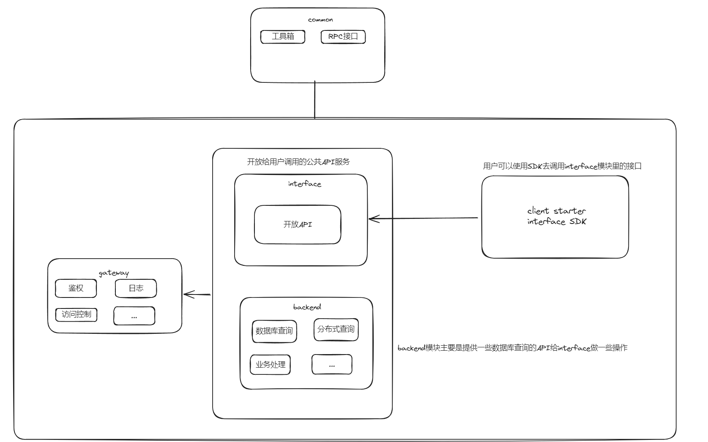
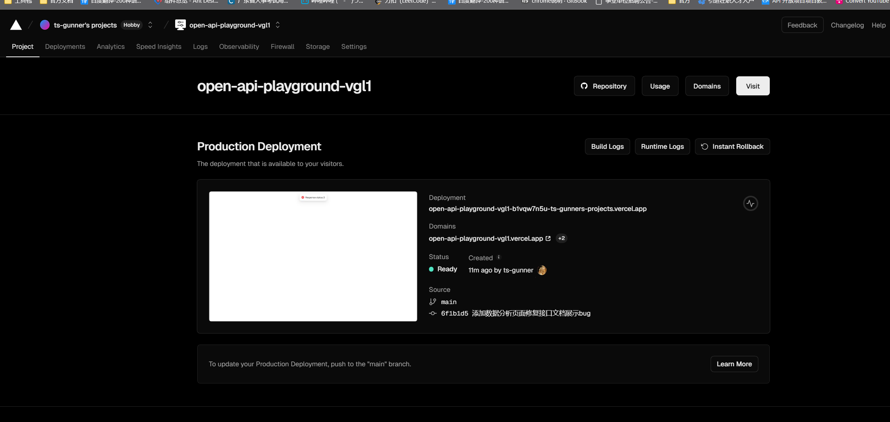

# API开放平台

## 背景

1. 前端开发需要用到的后台接口
2. 使用现成的系统的功能（`http://api.btstu.cn`）

做一个API接口平台：

1. 防止攻击（安全性）
2. 不能随便调用（限制，开通账号）
3. 统计调用次数
4. 计费
5. 流量保护
6. API接入

## 项目介绍

做一个提供API接口调用的平台，用户可以注册登录， 开通接口调用权限， 用户可以使用接口， 并且每次调用会进行统计。管理员可以发布接口、下线接口、接入接口，以及可视化接口的调用情况、数据。

## 基本框架

## 代码仓库

前端： [前端代码库: open-api-playground](https://github.com/ts-gunner/open-api-playground)

后端： [后端代码库: open-api-controller](https://github.com/ts-gunner/open-api-controller)

## 技术选型

### 前端

React

Antd Pro

Umi

### 后端

Java Springboot3

Springboot Starter(SDK开发)

Spring Cloud Gateway（网关）

Dubbo(RPC框架)

## 项目计划

### Part One

基础项目搭建(✔)

接口管理(✔)

用户查看接口(✔)

用户管理(✔)

角色管理(✔)

权限管理(✔)

分布式登录()

权限控制(✔)

### Part two

发布接口 (✔)

- 校验接口是否存在 (✔)

- 校验接口是否可用 (✔)

- 将接口状态改为1 (✔)

下线接口(✔)

- 校验接口是否存在(✔)

- 将接口状态改为0(✔)

接口调用(✔)

接口文档展示(✔)

接口在线调用(目前固定方法名调用)(✔)

保证调用的安全性（API签名认证）(✔)

API签名认证的校验(✔)

客户端SDK的开发(✔)

### Part three

统计用户调用次数(✔)

给用户分配或者用户自主申请接口调用次数(✔)

优化整个系统架构（API网关）(✔)
1. 路由（转发请求到模拟接口）(✔)
2. 统一鉴权（secretId, secretKey）(✔)
3. 统一跨域(✔)
4. 缓存
5. 流量染色（记录请求是否来源于网关）
6. 访问控制（黑白名单）(✔)
7. 统一业务处理(✔)
8. ~~发布控制~~
9. ~~脱敏~~
10. ~~负载均衡~~
11. 接口保护
    - 限制请求
    - 脱敏
    - 降级（熔断）
    - ~~限流~~
    - 超时时间
12. 统一日志(记录每次的请求和响应日志)(✔)
13. ~~统一文档~~

业务逻辑：
1. 用户发送请求到API网关(✔)
2. 请求日志记录(✔)
3. 用户鉴权（需要用到RPC）(✔)
4. 请求的模拟接口是否存在（需要用到RPC）(✔)
5. 请求转发，调用模拟接口(✔)
6. 调用成功，接口调用次数 + 1（需要用到RPC）(✔)
7. 调用失败，返回一个规范的错误码(✔)
8. 响应日志(✔)

限流

计费

网关需要查询数据库的部分数据，需要从其他微服务中调用对应的方法，因此使用Dubbo的RPC框架
整合Dubbo RPC框架

1. backend项目作为项目提供者
    1. 提供查询用户的密钥Id的接口实现方法(✔)
    2. 提供统计次数的接口实现方法(✔)

2. 怎么让其他用户上传接口？
   
    1. 需要提供一个机制（页面）， 让用户输入自己的接口host(服务器地址)、接口信息、遵循要求（SDK），
    在接入时，平台需要测试调用这个接口，保证正常使用
    2. 在接口信息表里添加host字段，区分服务器地址

3. 

### Part four

提供可视化平台，用图表方式展示所有接口调用情况，
1. 前端框架：(echarts for react)  https://github.com/hustcc/echarts-for-react

分析：
    1. 各个接口调用接口的次数占比（饼图）
    2. 

假设： 调用的少的可以免费， 调用的多的可涨价

拓展：

1. 开发管理员分析功能（后置的需求）

## 后端模块关系图

## 系统功能

1. 用户的增删改查

2. API接口的增删改查

3. 用户角色管理、角色权限管理、权限校验

4. API接口的发布与下线

5. API接口在线调用与文档展示

6. API签名认证校验

7. 客户端SDK开发，简化API调用代码

8. 给用户分配API资源

9. Gateway统一鉴权、统一跨域、统一日志管理、访问控制

10. 接口固定方法名改为根据API地址来动态调用

11. 完成部署

12. nacos配置管理

13. 账号单点登录

    

## todo

1. RocketMQ | Kafka
    
    1. 

2. 限流算法（请求频率）

## 优化点，拓展点

1. 降级熔断

2. 超时时间

3. sdk测试url与调用url不同

5. 怎么让其他用户上传接口

## 部署

前端：
后端：
- backend项目：web项目， 部署springboot的jar包（对外）
- gateway项目：web项目， 部署springboot的jar包（对外）
- interface接口项目：web项目， 部署springboot的jar包（内部）

### 前端部署

使用nginx部署: 44300

使用vercel快速部署。 https://vercel.com/

### 后端部署

1. 确定部署后的端口分配
    gateway：44388
    backend: 44380
    interface: 44389

2. nacos2.0.4部署： `https://blog.csdn.net/ilvjiale/article/details/129417768`

    docker安装： `docker pull swr.cn-north-4.myhuaweicloud.com/ddn-k8s/docker.io/nacos/nacos-server:v2.0.4`
    
3. java环境： `https://www.cnblogs.com/chaosmoor/p/15897693.html`

4. nginx：`https://www.cnblogs.com/orangebooks/p/12058830.html`

5. redis: `docker pull swr.cn-north-4.myhuaweicloud.com/ddn-k8s/docker.io/redis:5.0.14`

6. RocketMQ:  `https://rocketmq.apache.org/docs/quickStart/02quickstartWithDocker`

