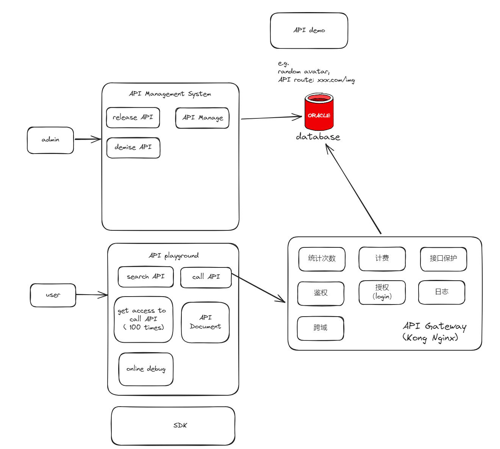

# API开放平台

## 背景

1. 前端开发需要用到的后台接口
2. 使用现成的系统的功能（`http://api.btstu.cn`）

做一个API接口平台：

1. 防止攻击（安全性）
2. 不能随便调用（限制，开通账号）
3. 统计调用次数
4. 计费
5. 流量保护
6. API接入

## 项目介绍

做一个提供API接口调用的平台，用户可以注册登录， 开通接口调用权限， 用户可以使用接口， 并且每次调用会进行统计。管理员可以发布接口、下线接口、接入接口，以及可视化接口的调用情况、数据。

## 基本框架

## 代码仓库

前端： [前端代码库: open-api-playground](https://github.com/ts-gunner/open-api-playground)

后端： [后端代码库: open-api-controller](https://github.com/ts-gunner/open-api-controller)

## 技术选型

### 前端

React

Antd Pro

Umi

### 后端

Java Springboot

Springboot Starter(SDK开发)

？？（网关）

## 项目计划

### Part One

基础项目搭建

接口管理

用户查看接口

### Part two

接口调用

接口文档展示、接口在线调用

保证调用的安全性（API签名认证）

客户端SDK的开发

### Part three

统计用户调用次数

限流

计费

日志

开通

### Part four

提供可视化平台，用图表方式展示所有接口调用情况，
假设： 调用的少的可以免费， 调用的多的可涨价

## 需求分析

1. 管理员可以对接口信息进行增删改查
2. 用户可以访问前台，查看接口信息
